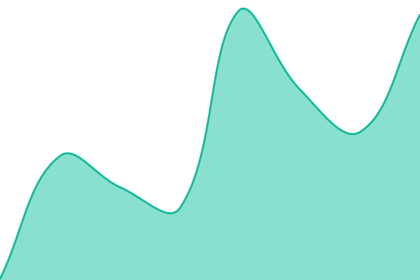
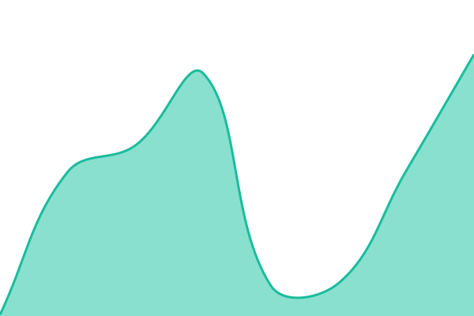
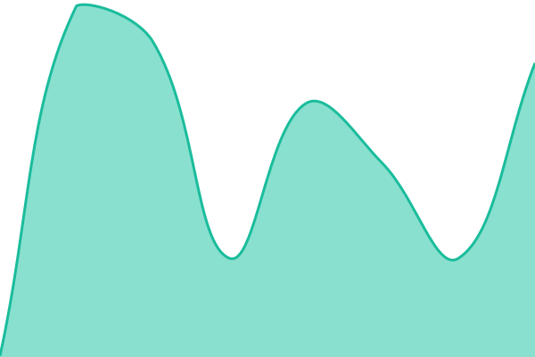
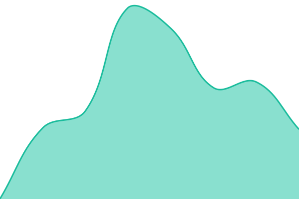
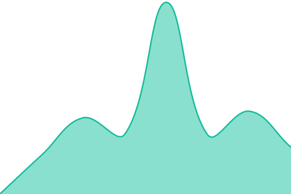
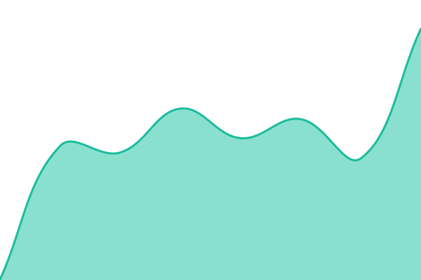
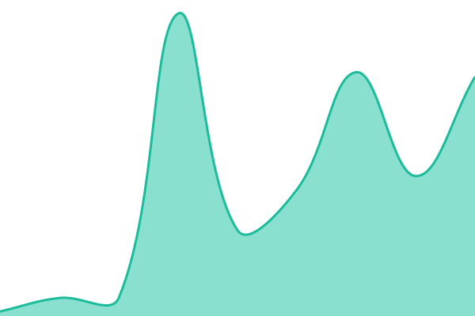
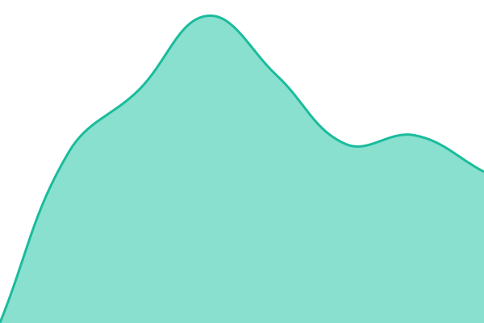
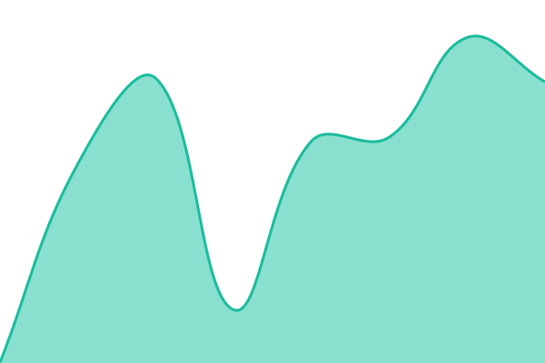
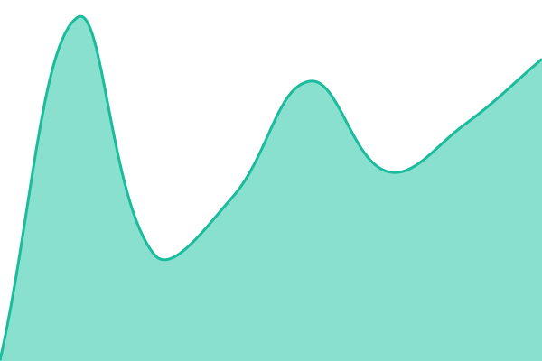

# [📈 Live Status](https://sadams0978.github.io/sam-upptime): <!--live status--> **🟩 All systems operational**

This repository contains the open-source uptime monitor and status page for [Sam Adams](https://sadams0978.github.io/sam-upptime), powered by [Upptime](https://github.com/upptime/upptime).

With [Upptime](https://upptime.js.org), you can get your own unlimited and free uptime monitor and status page, powered entirely by a GitHub repository. We use [Issues](https://github.com/sadams0978/sam-upptime/issues) as incident reports, [Actions](https://github.com/sadams0978/sam-upptime/actions) as uptime monitors, and [Pages](https://sadams0978.github.io/sam-upptime) for the status page.

<!--start: status pages-->
<!-- This summary is generated by Upptime (https://github.com/upptime/upptime) -->
<!-- Do not edit this manually, your changes will be overwritten -->
<!-- prettier-ignore -->
| URL | Status | History | Response Time | Uptime |
| --- | ------ | ------- | ------------- | ------ |
|  [PEAKE Technology Partners](https://peaketechnology.com/) | 🟩 Up | [peake-technology-partners.yml](https://github.com/sadams0978/sam-upptime/commits/HEAD/history/peake-technology-partners.yml) | 

 324ms
     
 | 

<a href="https://sadams0978.github.io/sam-upptime/history/peake-technology-partners">100.00%</a>
    

|  [PEAKE CW PSA](https://na.myconnectwise.net) | 🟩 Up | [peake-cw-psa.yml](https://github.com/sadams0978/sam-upptime/commits/HEAD/history/peake-cw-psa.yml) | 

 113ms
     
 | 

<a href="https://sadams0978.github.io/sam-upptime/history/peake-cw-psa">100.00%</a>
    

|  [PEAKE Ninja](https://us2.ninjarmm.com) | 🟩 Up | [peake-ninja.yml](https://github.com/sadams0978/sam-upptime/commits/HEAD/history/peake-ninja.yml) | 

 169ms
     
 | 

<a href="https://sadams0978.github.io/sam-upptime/history/peake-ninja">100.00%</a>
    

|  [PEAKE Voice](https://voice.peaketechnology.com) | 🟩 Up | [peake-voice.yml](https://github.com/sadams0978/sam-upptime/commits/HEAD/history/peake-voice.yml) | 

 533ms
     
 | 

<a href="https://sadams0978.github.io/sam-upptime/history/peake-voice">96.42%</a>
    

|  [PEAKE Voice Core 1](https://core1-dca.vectordata.net) | 🟩 Up | [peake-voice-core-1.yml](https://github.com/sadams0978/sam-upptime/commits/HEAD/history/peake-voice-core-1.yml) | 

 595ms
     
 | 

<a href="https://sadams0978.github.io/sam-upptime/history/peake-voice-core-1">96.52%</a>
    

|  [PEAKE Voice Core 3](https://core3-dca.vectordata.net) | 🟩 Up | [peake-voice-core-3.yml](https://github.com/sadams0978/sam-upptime/commits/HEAD/history/peake-voice-core-3.yml) | 

 535ms
     
 | 

<a href="https://sadams0978.github.io/sam-upptime/history/peake-voice-core-3">96.62%</a>
    

|  [PEAKE O365](https://login.microsoftonline.com/login.srf?whr=peaketechnology.com) | 🟩 Up | [peake-o365.yml](https://github.com/sadams0978/sam-upptime/commits/HEAD/history/peake-o365.yml) | 

 411ms
     
 | 

<a href="https://sadams0978.github.io/sam-upptime/history/peake-o365">100.00%</a>
    

|  [PASM](pasm.peaketechnology.com) | 🟩 Up | [pasm.yml](https://github.com/sadams0978/sam-upptime/commits/HEAD/history/pasm.yml) | 

 34ms
     
 | 

<a href="https://sadams0978.github.io/sam-upptime/history/pasm">100.00%</a>
    

|  [Rewst](https:/app.rewst.io) | 🟩 Up | [rewst.yml](https://github.com/sadams0978/sam-upptime/commits/HEAD/history/rewst.yml) | 

 723ms
     
 | 

<a href="https://sadams0978.github.io/sam-upptime/history/rewst">100.00%</a>
    

|  [Client Portal (Production)](https:/portal.peaketechnology.com) | 🟩 Up | [client-portal-production.yml](https://github.com/sadams0978/sam-upptime/commits/HEAD/history/client-portal-production.yml) | 

 545ms
     
 | 

<a href="https://sadams0978.github.io/sam-upptime/history/client-portal-production">100.00%</a>
    

|  [IT Glue](https://peaketechnology.itglue.com) | 🟩 Up | [it-glue.yml](https://github.com/sadams0978/sam-upptime/commits/HEAD/history/it-glue.yml) | 

 763ms
     
 | 

<a href="https://sadams0978.github.io/sam-upptime/history/it-glue">100.00%</a>
    

|  [Cisco Meraki](https://dashboard.meraki.com) | 🟩 Up | [cisco-meraki.yml](https://github.com/sadams0978/sam-upptime/commits/HEAD/history/cisco-meraki.yml) | 

 527ms
     
 | 

<a href="https://sadams0978.github.io/sam-upptime/history/cisco-meraki">100.00%</a>
    

|  [Slack](https://peaketechnology.slack.com) | 🟩 Up | [slack.yml](https://github.com/sadams0978/sam-upptime/commits/HEAD/history/slack.yml) | 

 312ms
     
 | 

<a href="https://sadams0978.github.io/sam-upptime/history/slack">100.00%</a>
    

|  [Google DNS](8.8.8.8) | 🟩 Up | [google-dns.yml](https://github.com/sadams0978/sam-upptime/commits/HEAD/history/google-dns.yml) | 

 4ms
     
 | 

<a href="https://sadams0978.github.io/sam-upptime/history/google-dns">100.00%</a>
    

|  [Cloudflare DNS](1.1.1.1) | 🟩 Up | [cloudflare-dns.yml](https://github.com/sadams0978/sam-upptime/commits/HEAD/history/cloudflare-dns.yml) | 

 5ms
     
 | 

<a href="https://sadams0978.github.io/sam-upptime/history/cloudflare-dns">100.00%</a>
    

<!--end: status pages-->

[**Visit our status website →**](https://sadams0978.github.io/sam-upptime)

## 📄 License

- Powered by: [Upptime](https://github.com/upptime/upptime)
- Code: [MIT](./LICENSE) © [Sam Adams](https://sadams0978.github.io/sam-upptime)
- Data in the `./history` directory: [Open Database License](https://opendatacommons.org/licenses/odbl/1-0/)
