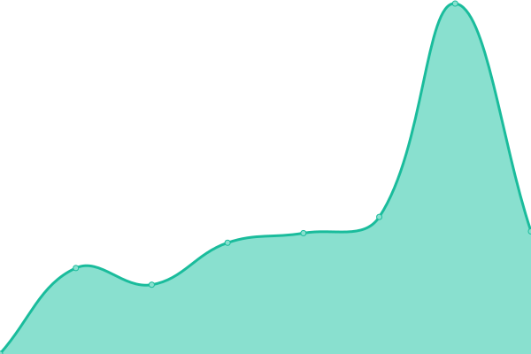

# [📈 Live Status](https://sadams0978.github.io/sam-upptime): <!--live status--> **🟩 All systems operational**

This repository contains the open-source uptime monitor and status page for [Sam Adams](https://sadams0978.github.io/sam-upptime), powered by [Upptime](https://github.com/upptime/upptime).

With [Upptime](https://upptime.js.org), you can get your own unlimited and free uptime monitor and status page, powered entirely by a GitHub repository. We use [Issues](https://github.com/sadams0978/sam-upptime/issues) as incident reports, [Actions](https://github.com/sadams0978/sam-upptime/actions) as uptime monitors, and [Pages](https://sadams0978.github.io/sam-upptime) for the status page.

<!--start: status pages-->
<!-- This summary is generated by Upptime (https://github.com/upptime/upptime) -->
<!-- Do not edit this manually, your changes will be overwritten -->
<!-- prettier-ignore -->
| URL | Status | History | Response Time | Uptime |
| --- | ------ | ------- | ------------- | ------ |
|  [PEAKE Technology Partners](https://peaketechnology.com/) | 🟩 Up | [peake-technology-partners.yml](https://github.com/sadams0978/sam-upptime/commits/HEAD/history/peake-technology-partners.yml) | 

 2638ms
     
 | 

<a href="https://sadams0978.github.io/sam-upptime/history/peake-technology-partners">98.14%</a>
    

|  [PEAKE SSO](https://sso.peaketechnology.com/adfs/ls/idpinitiatedsignon) | 🟩 Up | [peake-sso.yml](https://github.com/sadams0978/sam-upptime/commits/HEAD/history/peake-sso.yml) | 

 294ms
     
 | 

<a href="https://sadams0978.github.io/sam-upptime/history/peake-sso">100.00%</a>
    

|  [PEAKE CW Manage](https://cw.peakesupport.com) | 🟩 Up | [peake-cw-manage.yml](https://github.com/sadams0978/sam-upptime/commits/HEAD/history/peake-cw-manage.yml) | 

 329ms
     
 | 

<a href="https://sadams0978.github.io/sam-upptime/history/peake-cw-manage">100.00%</a>
    

|  [PEAKE CW Automate](https://lt.peakesupport.com/automate) | 🟩 Up | [peake-cw-automate.yml](https://github.com/sadams0978/sam-upptime/commits/HEAD/history/peake-cw-automate.yml) | 

 343ms
     
 | 

<a href="https://sadams0978.github.io/sam-upptime/history/peake-cw-automate">100.00%</a>
    

|  [PEAKE CW Control](https://help.peakesupport.com) | 🟩 Up | [peake-cw-control.yml](https://github.com/sadams0978/sam-upptime/commits/HEAD/history/peake-cw-control.yml) | 

 773ms
     
 | 

<a href="https://sadams0978.github.io/sam-upptime/history/peake-cw-control">99.77%</a>
    

|  [PEAKE Voice](https://voice.peaketechnology.com) | 🟩 Up | [peake-voice.yml](https://github.com/sadams0978/sam-upptime/commits/HEAD/history/peake-voice.yml) | 

 358ms
     
 | 

<a href="https://sadams0978.github.io/sam-upptime/history/peake-voice">100.00%</a>
    

|  [Vector Data Systems](https://vectordatasystems.com) | 🟩 Up | [vector-data-systems.yml](https://github.com/sadams0978/sam-upptime/commits/HEAD/history/vector-data-systems.yml) | 

 1909ms
     
 | 

<a href="https://sadams0978.github.io/sam-upptime/history/vector-data-systems">98.14%</a>
    

|  [PASM](pasm.peakesupport.com) | 🟩 Up | [pasm.yml](https://github.com/sadams0978/sam-upptime/commits/HEAD/history/pasm.yml) | 

 100ms
     
 | 

<a href="https://sadams0978.github.io/sam-upptime/history/pasm">100.00%</a>
    

<!--end: status pages-->

[**Visit our status website →**](https://sadams0978.github.io/sam-upptime)

## 📄 License

- Powered by: [Upptime](https://github.com/upptime/upptime)
- Code: [MIT](./LICENSE) © [Sam Adams](https://sadams0978.github.io/sam-upptime)
- Data in the `./history` directory: [Open Database License](https://opendatacommons.org/licenses/odbl/1-0/)
